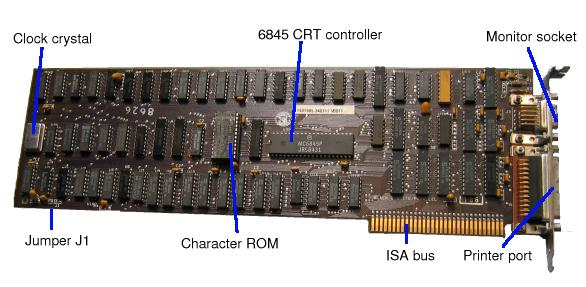
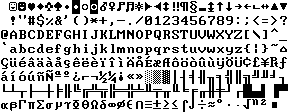
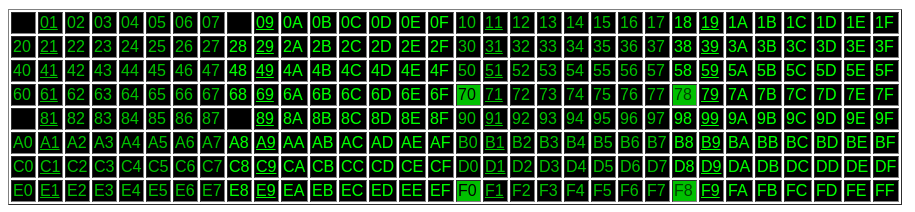
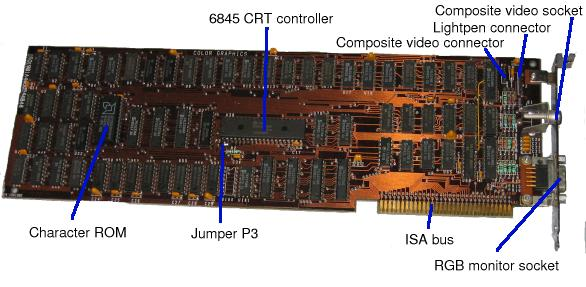

# 017. 显卡的发展历史回顾--之一

最近学习了一下历史上的显卡，还是以x86为线索。大致总结了一下。

显卡的进化可以分为以下几个阶段，也是显示的几种模式：

1. 文本模式
2. 彩色模式
3. 3D模式

## 文本模式

不得不感叹硬件体系下各个组件的兼容性，最初的显卡只有文本模式，而现代最新的显卡在刚刚初始化之后也仍然支持文本模式。文本模式简单的说就是把屏幕分为M行N列的方块，每个方块的位置有一个坐标，很个坐标上可以显示一个字符。

就像这样：

那时的显卡称为单色显卡适配器，英文缩写是MDA，全称是Monochrome Display Adapter。

那时的CPU还是8086/8088，CPU简单，CPU与显示适配器的接口也简单，大致就是几条地址线，几条数据线，加一些读写控制线，中断线之类的：

看起来没几跟线，但卡的板子确也像模像样的，接口也用上的金手指：

这种显示适配器和现在玩单片机的朋友手机的最基本款的LCD显示器带的控制器是一样一样的。它对CPU开放一段内存空间，这个内存空间也划分成M行 N列，你往对应行列的位置写入一个字节，这个字节对应的字符就会显示在屏幕对应的坐标位置。往一段内存里写东西就可以在屏幕上显示内容，熟悉linux的同学可以想到了frame buffer，对的，这东西就是对应的linux的framebuffer。这段内存也就是大家俗称的显存，它映射于0B0000h起始的位置，它不是一段内存，而是显示适配器以内存映射方式提供给CPU访问的一段内存空间。

所以MDA里面要有一个字节与字符对应的码表，好一点的MDA显示器有多张码表，比如说给俄国人用的时候就要换成俄国人的字母符号。更好一点的MDA甚至可以自字义码表。每张码表称为一个code page。这个code page有没有听着有点耳熟？对了，就是windows的cmd控制台设置界面也有这么一个code page配置项，而且与MDA这里的code page是一样的作用。

一个code page可能会是这样的：

上述字符对应的字节值是这样的：

 

其实就是ASCII码喽。

要切换code page怎么办呢？MDA还对CPU开放了几个IO口，可以通过in/out指令来控制：

> ### 03B0h, 03B2h, 03B4h, 03B6h: CRTC address register.
>
> Write a CRTC register number \(0 to 11h\) to this port to select the CRTC register that will appear at port 03B5h. For details of the registers, see the[6845 datasheet](http://www.surffi.net/~allu/shared/files/resources/crtc6545.pdf).
>
> These addresses are partially decoded on a real MDA, so that any even- numbered address between 03B0h and 03B7h will get you the CRTC address register. But the official register to use is 03B4h.
>
> This is a write-only register.
>
> ### 03B1h, 03B3h, 03B5h, 03B7h: CRTC register read/write.
>
> This gives access to the selected CRTC data register. Most CRTC registers are write only; some are read/write or read-only. As with the address register, this is partially decoded; so although the official address is port 03B5h, it also appears at the other odd-numbered addresses between 03B0h and 03B7h.
>
> ### 03B8h: Mode Control Register
>
> On a genuine MDA, this is a write-only register. Four of its bits can be set, but only two are any use:
>
> #### Bit 5: 1 to enable blinking, 0 to disable it.
>
> If bit 5 is 1, characters with attribute bit 7 set will blink. If not, they will have high intensity background.
>
> #### Bit 3: 1 to enable video output, 0 to disable it.
>
> If bit 3 is 0, screen output will not be shown. The usual use of this is if you're reprogramming the CRTC registers; disable video output beforehand and re-enable it after.
>
> #### Bit 1: 1 for black and white.
>
> This bit has no meaning, since the MDA always outputs in monochrome. The value written to it is stored \(in chip U58\) but nothing else on the card pays any attention to it.
>
> #### Bit 0: 1 for high resolution mode.
>
> For any sane purpose this bit must be set to 1. For details of what happens if it is set to zero, see[High Resolution Mode](https://www.seasip.info/VintagePC/mda.html#hrm).
>
> Quite why the MDA implements bits 0 and 1 is not clear. Possibly IBM originally planned to make an expanded MDA that supported 40 columns and/or colour; or perhaps the CGA was designed first, and the MDA was based on the CGA design, including vestiges of the CGA's 40-column and colour support. See also[colour MDA](https://www.seasip.info/VintagePC/mda.html#cmda).
>
> ### 03BAh: Status Register
>
> This is a read-only register. Only two bits of the value read from this port are defined:
>
> * Bit 3: Video. This is 1 if a green or bright green pixel is being drawn on the screen at this moment.
> * Bit 0: Retrace. This is 1 if the horizontal retrace is active.
>
> \(On a real IBM MDA, bits 7-4 are always 1, and bits 2-1 are always 0\).

针对这种显示适配器，不同的厂家还有一些改进，比如说支持更多的行和列，比如说彩色文本，但这些改进都没有什么本质上的改变。

## 彩色调色板模式

文本模式的MDA卡只支持显示文本，没法对屏幕做像素级的精确控制，你只能控制比如说某个8x8的区域显示字母A。要想显示不一样的东西就需要能过改码表来实现。不方便啊。

后来出现的彩色图形适配器就好用多了。因为可以做到像素级控制，所以叫图形适配器了。英文是CGA, Color Graphics Adapter。

它的使用方式与MDA差不多，也是把显存，也叫frame buffer，映射到CPU的地址上去。为了与MDA兼容，没有从0xB0000开始，而是错开了8KB给MDA用，它的起始地址是0xB8000。IO空间的地址也变为03D0h-03DFh。

CGA仍然支持文本模式，但也可以通过IO口控制切换到图形模式，在图形模式下，framebuffer每分为MxN个nibbles，nibbles即4比特，也就是说它用4比特控制一个像素的显示。4个比特的含义为：

> bit 3 = Intensity, Bit 2 = Red, Bit 1 = Green, Bit 0 = Blue

也就是说支持16种颜色。这16种颜色是固定的。

这时的显卡仍然是上面的那种接口，只是地址线多了一些，一个显卡大致是这样的：

了解一些图像编码的同学可能知道有些图像是有调色板的，比如说256色调色板。虽然支持颜色的个数没有变，但却可以动态的调整这256种颜色是哪些种。CGA的升级版本有些是支持调色板的，比如说256色调色板，它的每个像素用一个字节来表示，用一个字节来索引调色板中的颜色。

更进一步的CGA显卡则支持RGB888全彩色。

好了，先写到这里，后面还有好多内容要写，比如：

1. 更多型号的老式显卡介绍

2. ISA, VESA local bus, AGP等显示总线

3. VESA BIOS Extension

4. 3D显卡

5. AI芯片

