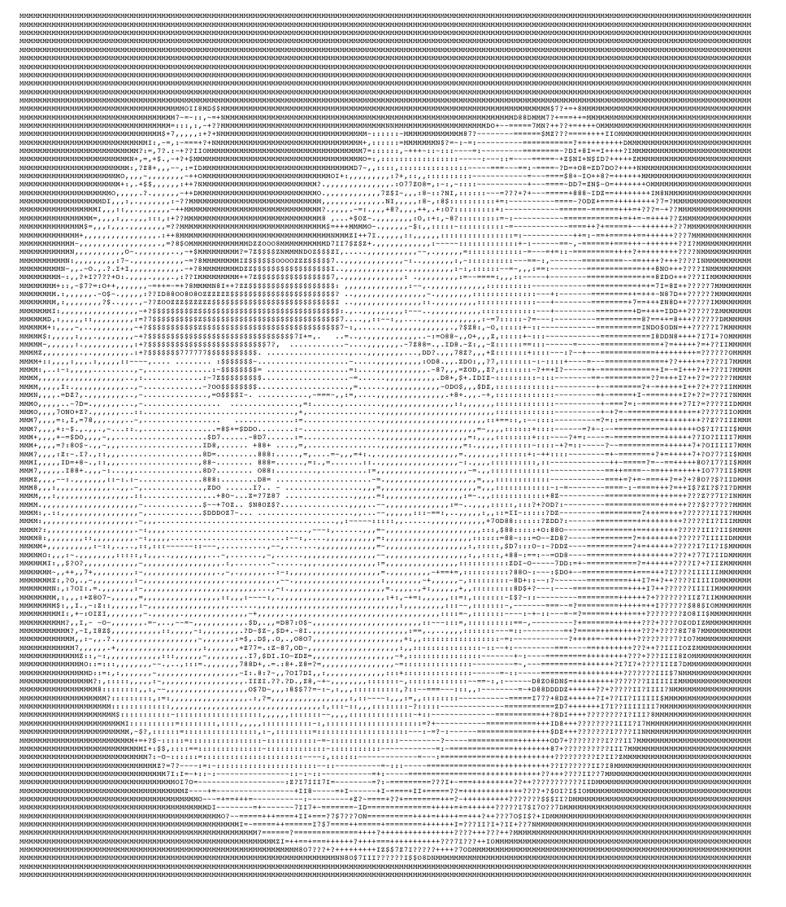
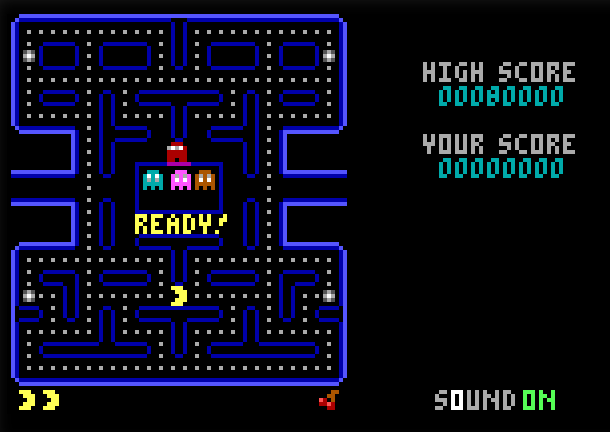
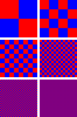
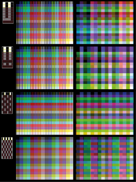

# 018. 显卡的发展历史回顾--之二

根据计划，本来这一节是说讲VESA的，但是觉得MDA/CGA还有很多有意思的地方，所以决定和大家一起了解一下MDA/CGA模式下一些好玩的玩法。

上一节讲到显卡发展的三个阶段，分别是文本模式、彩色模式和3D模式。这个是我自己胡乱划分的，可能划分的不是很准。
其实我所说的文本模式基本可以对应MDA显卡，彩色模式则指可以控制单个像素颜色显卡，它包括CGA显卡以及后续的VESA显卡等。

## 好玩的文本模式

### CGA显卡的标准文本模式

这里说的CGA显卡是指IBM出来标准CGA显卡。

它支持4个BIOS文本模式：

1. BIOS Mode 0/1:
  40列X25行文本，16种颜色。每个字符占用8X8个像素。屏幕分辨率是320X200。每个文本位可以显示256个字符中的一个，具体对应关系由code page决定，支持8个code page。BIOS Mode 0不支持彩色，只显示灰阶，BIOS Mode 1支持彩色。

2. BIOS Mode 2/3:
  80列X25行文本，16种颜色。每个字符占用8X8个像素。屏幕分辨率640X200。支持4个Code page。BIOS Mode 2不支持彩色。

一提到文本模式，大家可能想到的只是一个黑黑的屏幕上，显示一行一行的字符，看起来一点意思都没有。但任何艰苦的条件都限制不了人们的想像力。在MDA上，或是在CGA上使用文本模式时，人们还是可以实现一些比较有意思的显示的。比如说：

这个虽然看起来有些简陋，但是已经看起来好看了很多，对于初学电脑的人友好了不少。

实际上文本模式能做的事情远不止这些。文本模式下也可以玩出很多花样的。

### ASCII art

可能有人对linux比较熟，他们就会知道一些好玩的东西，比如说ascii art，比如说在command line播放视频。ASCII art是通过显示不同像素密度的文字来模拟大像素的。

### 用文本模拟像素

下面这个图片展示的是一个游戏，大家可以猜得到这个用文本模式显示出来的，但这个游戏只用到了一个字符，拿这个字符当作一个像素来绘制整个游戏。

在文本模式下，这个显卡只支持80列X25行的文本。为了画图形，软件作者要对行列做更精细的控制，所以他通过把cell height寄存器的值从8设置为2，把文本的高度由8个像素改成了2个像素，这样原来在横向上能显示25行的屏幕就可以显示100行了，这时一个文本一个列只显示了两个顶部的像素。在文本模式下，每个字符可以单独设置前景色和背景色，有一个字符的像素是画满字符左半部分的，右半部分是空的，即这个字符所在的方块左半部分显示的是前景色，右半部分显示的是背景色，作者可以通过合理设置它的前景色和背景色，让他来显示相同或不同的颜色，从而可以用这个字符来模拟两个大像素。这样作者通过一个字符把一个80X25显示文本显示区域变成了一个160X100的图形显示区域。

下图是一个**大像素**的显示图，它包含竖向两个像素，和横向4个向素。

## 彩色模式的一些黑科技

最初的彩色显示远没有现在的显示这么方便，显示器也没有现在的显示器好用，所以人家想出了很多方法来越过这个限制。

### 标准图形模式

CGA显卡提供3种标准BIOS图形模式，也称为all points addressable模式。

1. BIOS Mode 4/5: 
  320 X 200像素，同一时间仅能显示4种颜色，总共有16种颜色。BIOS Mode 4和5都是这种模式，4和5的区别在于BIOS Mode 4使能彩色显示，BIOS Mode 5关闭彩色显示，只显示灰阶。

2. BIOS Mode 6: 
  640 X 200像素，只是单色模式，即背景色固定为黑色，前景色可以选为别的颜色，但只能有一种前景色。

### 突破图形模式限制的技巧

1. 运行时改变调色板

在4.77MHz的8088 CPU上，通过严格的时序控制，可以在每个扫描行上应用不同的调色板。从而打破同时只能使用4种颜色的限制。

2. 通过dittering显示调色板不提供的颜色

即利用不同颜色的混合出现，显示一个混合后的颜色，比如说红色和蓝色混合出紫色。

3. 通过模拟电视显示器的缺陷显示1024种颜色

模拟电视显示器的信号只有一路，而且是模拟的，很容易出现一些时序问题，从而导致相临的颜色互相干扰。

有经验的程序员却可以通过合理利用这个缺点，让CGA显示同时显示16种颜色，甚至组合利用其他技巧突破调色板限制，制造出1024种颜色。

具体可以参考：

https://en.wikipedia.org/wiki/Composite_artifact_colors

