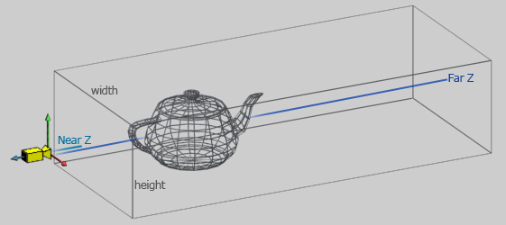
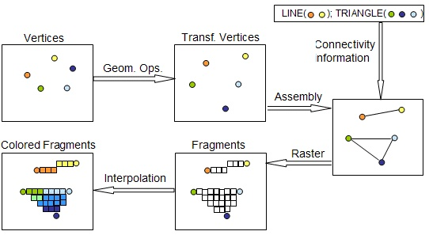

# 020. 现代显卡之一

本来这篇文章已经写完了，结果知乎的草稿系统有点问题，都给我保存丢了。所以决定以后写文章一定先在gitbook上写好，再复制到知乎上来。

另外，介绍一下我写文章的思路。有些人觉得我写显卡历史的时候某些不重要的显卡介绍了，某些非常好用的显卡却没有介绍，不太理解我这样写的原因。其实我写文章的同时也是自己在学习，也是在为自己解答一些过去的疑惑。

我之所以了解x86体系统构是因为我做过一段时间的UEFI，也就是传统BIOS的替代软件，统称Firmware。我在学习UEFI时有很多疑惑，遇到很多名词都不是现代CPU上的东西，而是legacy硬件上的一些东西。由于x86体系向旧兼容做得太好了，所以Firmware的代码中要包含x86的演进过程，即你先把它当成一个8086使用，再把它当80386使用，等等，一点一点开启新功能，直到它的所有功能都开启了，并关闭一些旧的功能，这时它才是一款现代的CPU。

GPU同样如此，UEFI代码要把显卡当做ISA显卡使用，当做VESA显卡使用等等。显卡的技术也是一点一点演进的，每一代演进的产品中比较经典的内容会在现代显卡上仍然留下痕迹，而另一些在典型产品基础上锦上添花做微创新的显卡技术则不会留下痕迹。我写文章的同时，也在解答我做UEFI时积累的一些疑问，自然就会偏重在现代显卡上仍然能留下痕迹的legacy显卡。这些显卡知识更重要一些。当然，其他的显卡上使用的一些技术如果能了解的话也很有趣，也可能给大家带来一些收获，但这就看我时间是不是很多可以去整理了，另外，我毕竟不是那个时代的人，所以体会也没有那么深刻。评论区有一些用过古旧显卡的同学，也欢迎投稿。欢迎私下联系我。

## 从2D到3D

显示器是只能显示二维图像，而世界是三维的。在字符和UI界面之外，人们通常希望显示的东西都是与现实世界对应的。比如说图片，它是对三维世界截了一个平面。

在显卡仅支持2D显示的时候，人们需要通过人肉的方式把三维世界通过二维图形表示出来。这种方式非常费时费力，所以人物动作只能被表现为有限个关键帧，人物动作通常是像皮影戏一样的动作，而不会包含旋转。这样的图像看起来没那生动。人们希望机器能直接把3D的物体转化为2D的图像。

现实世界的3D物体转换为2D图像非常简单，拿个照相机去拍就行了。但其实这也不简单，因为人物每旋转一个角度，对应的2D图像都是不一样，你不能穷举一个人所有可能动作，然后都拿照相机拍摄出来。这里有两个难题，一个是人会累，让他摆各种动作，二是存储容量也会非常大。

在虚拟世界里，人们可以创造一个3D人物，让他做各种动作很容易，他不会累，而且可以随心所欲的做动作，可以受游戏玩家的控制。存储容量也不是问题，因为一个动作做出来，拍成图像后只需要给玩家看一眼就行了，不需要保存。动作-拍摄都是机器完成的。唯一需要解决的问题就是怎么把这个过程变成实时的，即玩家或游戏逻辑导致人物做出某个动作后，怎样立即生成2D图像。这就是现代显卡或是GPU的主要功能，即输入一个3D物体，输出一个2D图像。

上图是一个经典的图片。一个由多边形组成的3D模型，如何生成2D图像？这其实就是一个数学问题。即图中的茶壶，在摄像机位置观察它，看到的是一个什么样的图像。

这里首先要搞清楚输入是什么，一个3D模型输入给显卡简单的讲是两部分（实际上不止），即一组点和一组连接关系。连接关系就是说哪两个点组成一条线，哪三个点组成一个三角形等。由于某些大家猜得出来的原因，现在GPU多时用三角形来表示模型。上图上的茶壶中的每一个四边形都会由两个三角形来表示。

光有点和线还不足以表现一个细节非富的人物理，人们有时需要给三模型上色，或是贴图。

上图简要描述了一个3D模型进入到显卡后经历的操作。
1. 每个顶点除了有x,y,z做标之外还可能有一个颜色值或一个贴图（专业语言叫纹理）坐标。
2. 这些顶点在GPU里可能需要做一些变换，比如模型的放大，缩小，旋转等。
3. 输入顶点之间的连接信息，比如说两个点组成了一条线，三个点组成了一个三角形。
4. 栅格化，将线或三角形切分，也即将一个连续的模形离散化，一个单位称为一个片元(fragment)，一个片元描述了一个像素点的z坐标、颜色等信息。
5. 插值（interpolation)，三角形内部，线的中间部分的颜色是按照顶点上的颜色插值出来的。
6. 根据遮挡关系，仅显示不被遮挡的部分。
由于要操作的数据量比较大，而且操作的数学计算极为模式化，所以人们设置了一个具有多个处理单元的芯片，每个处理单元都非常简单，但一个芯片里可以有上万个单元，每个单元处理一个像素（只是举例，不严谨），大家一起工作，从而处理速度很快。

## 显卡到AI芯片

以上是一条固定的流水线。用户可以通过设置显卡的寄存器来决定一些事情，比如说插值采用什么算法等。

后面人们发现要想显示的图像更加好看，显卡用起来更加顺手，需要某些处理步骤可以更加灵活的配置，比如说顶点的处理环节，可以不局限于放大缩小等操作，片元处理环节可以不仅仅是插值或贴图，还可以根据某些数学计算来生成每个像素的颜色。于是芯片设计师把这些步骤的处理部件改可以可编程的，它们就像简单的CPU可以跑一种简单的代码逻辑，由于他们都是做同样的处理，所以他们是同时跑同一份代码，只是输入输出的数据源和数据目的地不同。这些处理部件称为一个显卡的一个核，它上面跑的特殊编程语言称为shader language。

后来人们发现一些大批数的数据处理也符合这种处理模式，即一批数据需要经过同样的处理步骤，但输入输出不同。这样的数据用GPU来处理会非常的快。于是显卡就变成了GPU。

既然很多人用GPU去做计算，那我们为什么不把GPU设计得更适合这类计算一些呢？由于GPU的功能就越来越偏离显示功能，而趋近于计算功能。它就有了一个新的名字GPGPU。

在这类计算中，有一个小的分类叫做AI，它比较火，于是有一部分芯片专门为AI设计，完全没有了显示的功能，就成了AI芯片。

整个演进过程为：
固定流水线显卡->非固定流水线显卡GPU->GPGPU->AI芯片。

下一节分段详细介绍。