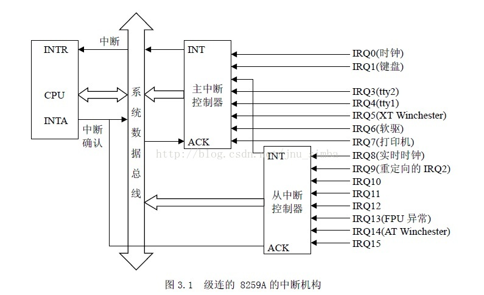
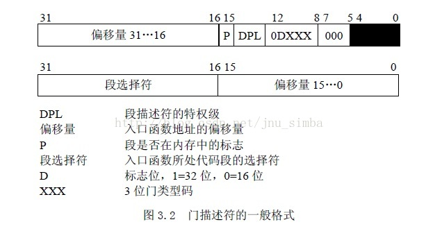
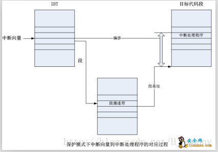

# 8086的中断处理

## 中断向量表
8086支持256个中断，对应每个中断需要安排一个中断服务程序。256个中断服务程序的首地址(CS:IP)按序排列在一起组成一个**中断向量表**, 每个中断向量由4字节组成。这4字节指明了一个中断服务程序的段值(赋值给CS)和段内偏移值(赋给IP)。因此整个向量表的长度为1KB=256*4，占据物理地址范围是0x00000 ~ 0x003FF。当 8086 CPU启动时，BIOS中的程序会在物理内存开始地址0x0000:0x0000处初始化并设置中断向量表，而各中断的默认中断服务程序则由BIOS中给出。由于中断向量表中的向量是按中断号顺序排列，因此给定一个中断号N，那么它对应的中断向量在内存中的位置就是0x0000:N×4，即对应的中断服务程序入口地址保存在物理内存0x0000:N×4位置处。

## 中断分类
所有256 种中断可分为两大类：异常和中断。异常又分为故障（Fault）、陷阱（Trap）和夭折（Abort），异常的共同特点是既**不使用中断控制器**（不通过8259A上传中断信号），又不能被屏蔽。中断又分为外部可屏蔽中断（INTR）和外部非屏蔽中断（NMI），所有I/O 设备产生的中断请求（IRQ）均引起屏蔽中断，而紧急的事件（如硬件故障）引起的故障产生非屏蔽中断。

非屏蔽中断的向量和异常的向量是固定的，而屏蔽中断的向量可以通过对中断控制器的编程来改变。但通常大家都遵循一个惯例。比如Linux 对256 个向量的分配如下。
• 从0~31 的向量对应于**异常**和**非屏蔽中断**。
• 从32~47 的向量（即由I/O 设备引起的中断，共16个，对应两个8259A级联所通产生的最大中断个数）分配给可屏蔽中断。32——47也即**0x20~0x2F**。
• 剩余的从48~255 的向量用来标识软中断。**Linux 只用了其中的一个（即128 或0x80向量）用来实现系统调用**。当用户态下的进程执行一条int 0x80 汇编指令时，CPU 就切换到内核态，并开始执行system_call() 内核函数。(注意，最新的Linux系统已经不使用这种方式，但兼容这种方式）。

## 中断源与8259A

8086采用8259A做为中断控制器，当时是做为单独的芯片，随着计算机的发展会集成到CPU中，但这个芯片的逻辑在最新的x86计算机中也依然存在的（集成在南桥里）。 8259A单片芯片有8个中断输入引脚，通常两片级联使用，共15个中断输入信号。

8259A与CPU的接口包括三部分，一是中断向量号，这部分数据通过系统总线传给CPU，二是中断请求信号，做为一根单独的引脚接在CPU的INTR上，三是INTA引脚，用于接收CPU的中断确认后消除中断。

一般的执行流程是这样的，IO设备产生一个中断，发生一个电平变化给8259A，8259A将**中断向量号**（注意这里是中断向量号而不是IRQ号，后面会有详细解释）编码后放在系统总线上，然后发出一个INT信号。
CPU收到INT信号后读取中断向量号,然后去IDT中检询对应的中断处理函数地址，执行这个中断处理程序。中断处理程序通常首先发一个INTA信号，通知8259A该中断已经被响应，可以消除了。

8259A各个引脚上的中断信号源分配是有一定的规则的，或者说是惯例，也就是说你的计算机硬件不一定是这个样子的，但有很大概率就是这个样子的。通常的规则如图中所示，

首先，级联时用IRQ2（也有的机器用IRQ9)做为级联引脚，接第二片8259A的的输出。也就是说IRQ2(或IRQ9)通常是没有中断产生的。

其次，通常的硬件产生IRQ的顺序为:
IRQ0  时钟
IRQ1  键盘
IRQ3  tty2
IRQ4  tty1
IRQ5  XT Winchester
IRQ6  软驱
IRQ7  打印机
IRQ8  实时时钟
IRQ9  重定向的IRQ2
...
## IRQ与中断向量号

前面讲到根据惯例，IRQ0对应的是中断向量号是0x20即32。然而惯例虽然是惯例，却也是可以通过配置硬件来设置的。这个设置就是通过8259A初始化时的ICW3控制字，该控制字传入一个8位数字，但它的低三位是没有意义的，仅高5位有意义。当8259A中产生一个中断时，会得到一个引脚编号0~7, 组成一个三位数作为低三位，然后加上ICW3传入的高5位组成一个字节，就是最终的中断向量号放在系统总线上。
也就是说，在上文讲的惯例模式下，需要对两个8259A单独设置ICW3，第一片8259A的ICW3设为0x20，第二片8259A作为从片ICW3设置为0。

如果第一片8259A的ICW3设置为0x30，则键盘中断的中断向量号就成了0x31，BIOS要设置中断向量表时，就要在第0x31个中断向量处设置键盘中断的处理程序首地址。

由于ICW3、中断向量表、中断处理函数都是BIOS的控制范围，无论怎么设置，只要BIOS自己跟自己保持一致即可。

## 8259A的编程

8259A的编程分为初始化编程和运行时编程，初始化编程即配置8259A的运行状态，如是否是两片级联工作，如果是两片级联工作的话，当前被配置的这一片是主片还是从片，它的中断向量号高5位是什么，是电平触发还是边沿触发等。

运行时编程实际上是操作8259A，读取当前产生中断的中断向量号，设置中断屏敝寄存器来上忽略某些不正常工作的中断信号原产生的中断等。受操作的三个寄存器就是经典的IMR, ISR和IRR。

对8259A编程是通过两个IO口来进行。最近ARM等体系结构比较火，可能大家对86的IO口不太记得了。8086对访存和访问外设是采用不同的总线协议的，也是采用不同的汇编指令。内存访问采用mov指令，IO口的读写则是用in,out指令。从现代人的角度讲，将IO与内存访问从CPU的角度区分开是不合适的。然而当时访存和IO总线都是从CPU直接引出，为了减少引脚数又做了复用，IO设备和内存的时序参数又不一样，所以才做了这样的区分。为了做到兼容，这些设计在最新的计算机上仍然可用。8259A使用了两个IO口,这两个IO口的地址与具体的引脚连线有关。在最新的计算机中，8259A已经被集成在南桥中，这两个IO口的地址已经不能通过引脚连线来决定，而是通过配置南桥的相关寄存器来决定。

8259A的详细配置有很多教材，这里不详细展开，仅提供一个链接：
https://wenku.baidu.com/view/80ed56f9650e52ea54189890.html

# 80286的中断处理

8086中，中断是通过中断向量表提供中断服务程序入口的。中断向量表即放在内存中固定位置的一组指令，通常为跳转指令，跳转到真正的中断服务程序中断。

在8086中，这个地址是完全没有保护的，程序会不会去破坏它全凭良心。CPU这样设计是不对的，对于一个复杂的软件组织，一定要给操作系统能力来保护这些中断向量，让他们不能被轻易篡改，不能被没有权限的程序执行。

对中断服务代码保护通过段式内存管理装置即段描述符就可以搞定，但是用户软中断如何越权访问仍然是一个问题，这个问题已经解决过了，那就是在任务状态段描述符的基础上增加任务门描述符。对于中断，还增加了中断门描述符。

中断描述符表IDT本质上就是中断向量的入口，一个中断产生后，中断号做为索引，去中断描述符表IDT中检索出一个描述符，然后执行描述符对应的程序。这个描述符可以是中断门描述符、陷阱门描述符和任务门描述符。

每个描述符仍然是8字节，最多支持256个中断，估共2KB。

CPU执行中断处理程序时要进行两步检查：
1. 首先是“**段**”级检查，将CPU 的当前特权级CPL（存放在CS寄存器的最低两位）与IDT 中第 n 项中的段选择符中的RPL 相比较，如果RPL（3）大于CPL（0），就产生一个“通用保护”异常（中断向量13），因为中断处理程序的特权级不能低于引起中断的程序的特权级。这种情况发生的可能性不大，因为中断处理程序一般运行在内核态，其特权级为0。然后是“**门**”级检查，把CPL 与IDT 中第 n 个门的DPL 相比较，如果CPL （3）大于DPL（0），CPU 就不能“穿过”这个门，于是产生一个“通用保护”异常，这是为了**避免用户应用程序访问特殊的陷阱门或中断门**。但是请注意，这种检查是针对一般的用户程序引起的中断（INT 指令），而不包括外部I/O 产生的中断或因CPU内部异常而产生的异常，也就是说，如果产生了中断或异常，就免去了“门”级检查。

2.检查是否发生了特权级的变化。若中断发生时CPU运行在用户空间，而中断处理程序运行在内核态，特权级发生了变化，所以会引起堆栈的更换。也就是说，从用户堆栈切换到内核堆栈。而当中断发生在内核态时，即CPU 在内核中运行时，则不会更换堆栈。前一种情况通常意味着0x80系统调用。

CS : EIP 的值就是IDT 表中第n 项门描述符的段选择符和偏移量的值，此时，CPU 就跳转到了中断或异常处理程序。