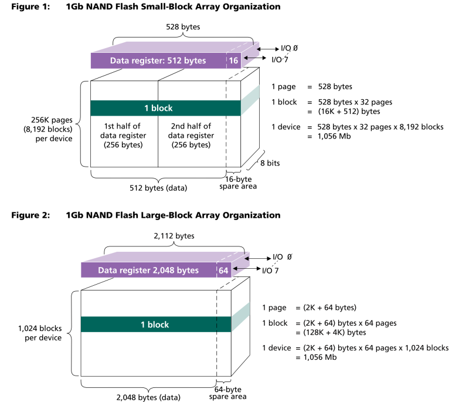
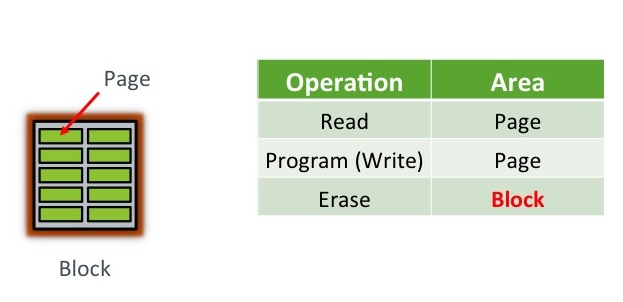
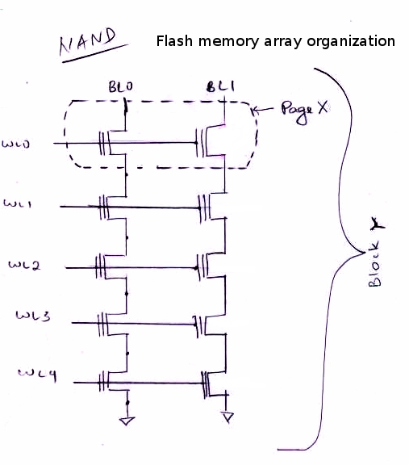
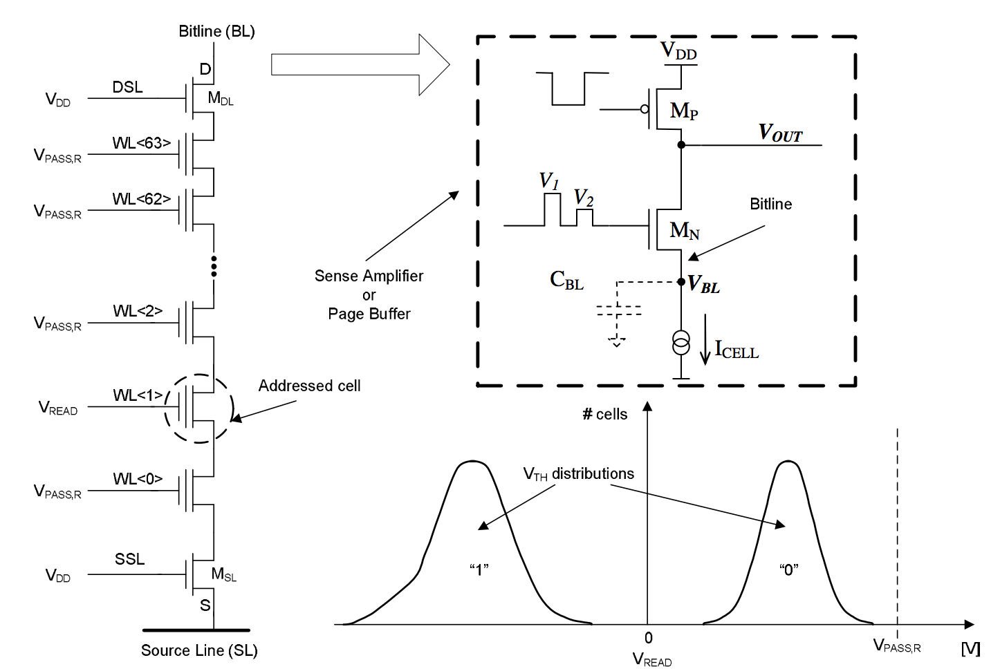
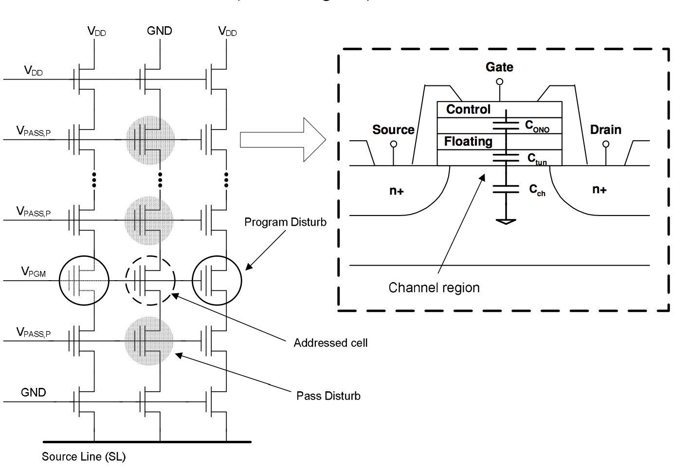
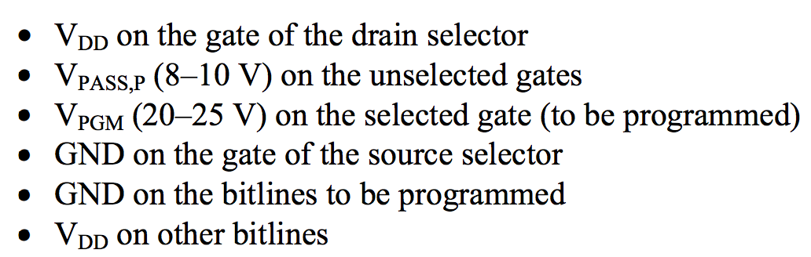
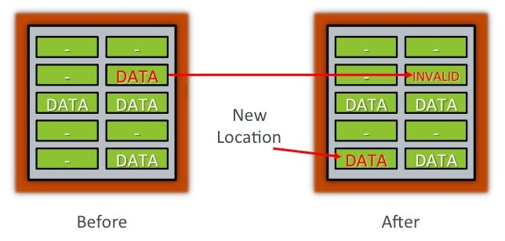

# 1. 封装

Nandflash一颗芯片中封装一个硅片称为一个Die，一个Die内部可能再分为两个平面，称为Plane。Plane有多个Block，每个Block又分为多个Page。

通常大家不会关心Die和Plane。而是从Block以下开始关注。  
一页的数据有时还分为上半页和下半页，并且每页附带几个字节的多余存储空间，称为spare area。一些Nandflash管理程序会利用spare erea来做一些管理数据、ECC校验数据等。  
通常一个block有256、1024、2048个pages。  
一个page通常有512、1024、2048等个字节。  

# 2. Nandflash的基本操作

Block是擦除的最小单位，Page是读写的基本单位。  

## 2.1 擦除

Nandflash不像内存或是硬盘一样可以改写。它上面的一个比特（对于SLC\)而言）一旦被写为1，就不能再单独改写为0，而必须和它所在的Block上的所有其它位一起全部擦除为0.

## 2.2 写

我们说Nandflash的写操作是以Page为单位的，但是实际上你可以精确到Page上的单位。比如说你可以先写bit 0为1，再写bit 1为1。但是你不可以回过头来把bit 0写为0，因为只有擦除操作才能把写为1的位改回0.

## 2.3 读

说读的基本单位为Page。你当然也可以一次中读Page中的几个位，但是所有的时间都是一样长的。

# 3. Nandflash的内部结构

下图是Nandflash的一个块的内部结构，这个图片非常经典。可以看到，一个Block实际上是芯片中晶体管组成的一个阵列。而一个Page才是这个阵列的一个行或是行的一部分，即一行可能又分成多个Page。  

WLx为第x行的行选线，但WLx为高电平时，整个行（即一个Page\)上的cell都可以操作。WL是Word Line的缩写。

BLx为行上第x位的位选线，在一个行WLx被选中的情况下，给BLy加高电平就可以在相应的位上写入1。

## 3.1 读时内部路行为

在通常的Nandflash芯片中，一个Block有一行的sense amplifier，连接在每个bit line上，读数据时，先用Vread选中一行，将不选中的行的word line置为Vpass，使那个晶体管有导通功能。然后选中的行上的各cell上的数据就会被sense amplifier读出来。  
**读操作各部位电压**

## 3.2 写（编程）时内部电路行为

编程是往一个cell写1的过程同样是将不选中的行置为Vpass，要选中的行的word line置为Vpgm，选中的bit line置为GND，其他bit line置为VDD。  
**写操作各部位电压**  
即：  

## 3.3 擦除时内部电路行为

擦除。

# 4. Nandflash不支持in-place update

Nandflash的一个页不能写了之后几乎不可以改写，只前整块擦除。如果要改变一个页上的数据，通常的做法不是擦除整个块然后再全部修改了再写上去，而是将这个页的内容标志为无效，将修改后的数据写到新的页上，然后更新指针指到新的页上。这是flash translation layer的一基本操作。Flash translation layer简称FTL，是一个业界常研究的课题。

**nand flash page update\(out-of-place update\)**

# 5. SLC、MLC和TLC对比

SLC = Single-Level Cell ，即1bit/cell，速度快寿命长，价格超贵（约MLC 3倍以上的价格），约10万次擦写寿命

MLC = Multi-Level Cell，即2bit/cell，速度一般寿命一般，价格一般，约3000---10000次擦写寿命

TLC = Trinary-Level Cell，即3bit/cell，也有Flash厂家叫8LC，速度慢寿命短，价格便宜，约500次擦写寿命，目前还没有厂家能做到1000次。

## 5.1 速度对比

SLC速度最快，MLC速度比TLC更快。但也有资料显示，MLC是不是比TLC快要看制程的，新制程的TLC比老的MLC快多了，不过寿命的确是MLC要长点。

## 5.2 擦写次数对比

“TLC芯片”只能写500次并非意味着U盘拔插500次就完蛋了！简单举例，假设一个8G U盘，往里面写入8G，就算一次；清空写入3G，算第二次，在清空写入5G，仍然算第二次；再写入1G，那现在就开始算第三次。  
换个角度来理解，假设8G U盘一生只能擦写500次，那么这个U盘一生理论上可以重复装载4000G 文件。而MLC芯片的U盘一生最少都能装载2.4万G到8万G。这就是为什么说TLC芯片的U盘相对短命的原因。  
关于TLC：  
X3\(3-bit-per-cell\)架构的TLC芯片技术是MLC和TLC技术的延伸，最早期NAND Flash技术架构是SLC\(Single-Level Cell\)，原理是在1个存储器储存单元\(cell\)中存放1位元\(bit\)的资料，直到MLC\(Multi-Level Cell\)技术接棒后，架构演进为1个存储器储存单元存放2位元。   
2009年TLC架构正式问世，代表1个存储器储存单元可存放3位元，成本进一步大幅降低。  
如同上一波SLC技术转MLC技术趋势般，这次也是由NAND Flash大厂东芝\(Toshiba\)引发战火，之后三星电子\(Samsung Electronics\)也赶紧加入战局，使得整个TLC技术大量被量产且应用在终端产品上。  
TLC芯片虽然储存容量变大，成本低廉许多，但因为效能也大打折扣，因此仅能用在低阶的NAND Flash相关产品上，象是低速快闪记忆卡、小型记忆卡microSD或随身碟等。  
象是内嵌世纪液体应用、智能型手机\(Smartphone\)、固态硬碟\(SSD\)等技术门槛高，对于NAND Flash效能讲求高速且不出错等应用产品，则一定要使用SLC或MLC芯片。  
2010年NAND Flash市场的主要成长驱动力是来自于智能型手机和平板计算机，都必须要使用SLC或MLC芯片，因此这两种芯片都处于缺货状态，而TLC芯片却是持续供过于求，且将整个产业的平均价格往下拉，使得市调机构iSuppli在统计2010年第2季全球NAND Flash产值时，出现罕见的市场规模缩小情况发生，从2010年第1季43亿美元下降至41亿美元，减少6.5%。

# 6. ECC、坏块和wear leveling

由于Nandflash的Cell是有擦写次数限制的，多次使用之后某个cell就可能无法再被擦除并写入正确的数据。这时，这个块称为坏块。  
软件在使用Nandflash时，需要管理这些坏块，将坏块记录下来，以后写数据是避开。  
软件再使用Nandflash时，还需要注意尽量将擦除操作分配到不同的块上。这样可以减小坏块的产生（直到所有Block接近一起坏掉）。这个行为称为wear leveling。  
你为法预料到哪个块的哪个cell在什么时候出错，因而通常在写入数据时同时在spare erea写入ECC校验数据，以便在出现坏的某个cell首次坏掉时可以检测到并恢复数据。

# 7. 参考资料

[1. Understanding Flash: Blocks, Pages and Program / Erases](https://flashdba.com/2014/06/20/understanding-flash-blocks-pages-and-program-erases/)

[2. SD知识篇——关于闪存芯片SLC、MLC和TLC](http://bbs.ixpub.net/thread-9814705-1-1.html)

[3. Nand Flash 基本介紹](http://cmchao.logdown.com/posts/60216)

[4. Sense Amplifier for Flash Memories: Architectural  
Exploration and Optimal Solution](https://repository.iiitd.edu.in/jspui/bitstream/123456789/377/1/MT13156.pdf)

[5. MODELING THE PHYSICAL CHARACTERISTICS  
OF NAND FLASH MEMORY](http://itzbhushan.gitlab.io/files/Thesis.pdf)

**长按识别二维码或手机扫描二维码  
打赏我1.5元**  

