我们知道x86计算机的第一颗芯片是8086，之后有了80286、80386、80486、奔腾。。，本文将会用很多图来各大家加顾一下x86计算机的发展历史，让大家知道现在的计算机的每一个部分是什么时候加上去的，为了各历史上的哪一件事情做兼容。 
 

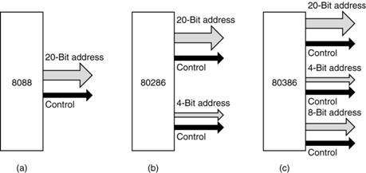

The Intel 8086 had a 20–bit address line.

It could address 1 MB of memory.

The Intel 80286 had a 24–bit address line.

It could address 16 MB of memory.

The Intel 80386 had a 32–bit address line.

It could address 4 GB of memory.

# 8086

下面这张图片是IBM PC，看起来很带感，好想有一个。  
  
IBM PC（IBM Personal Computer 5150）诞生于1981年，在IT领域长期占据着头把交椅，是IBM的首款产品。

两年后的IBM PC XT是对IBM PC的扩展，采用8088处理器：

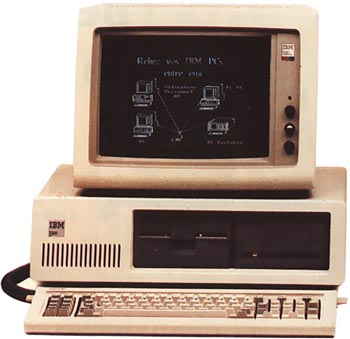

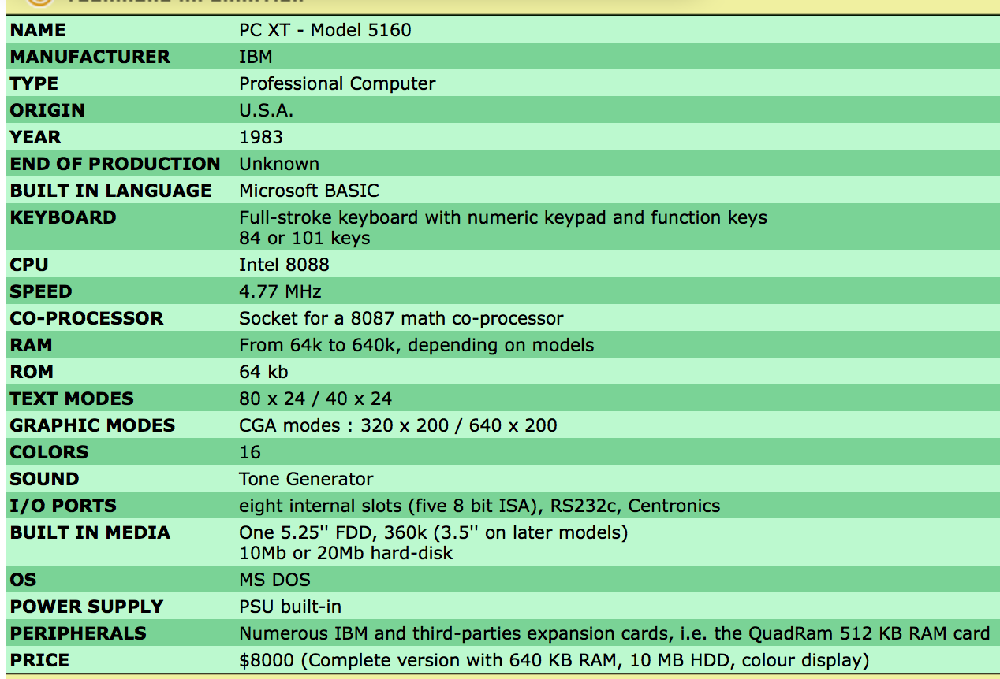

下面是使用8088的升级板IBM PC XT的电路图：  
IBM PC 5160主要电路板为主板，集成4.77MHz Intel 8088处理器、64KB内存，最高可扩展至256KB，机身标配5个拓展槽，内置单/双软驱但不支持硬盘并通过电线和主板连接，标准存储器为卡式录音带，ROM装配有 Microsoft BASIC。  
为了优化这款产品的任务处理性能，IBM还使用了NEC V20处理器来提升运行性能，并引入Intel 8087辅助处理器可以提高其数学处理能力。比较有意思的是，这款产品标配黑白显示器，内置的彩色图形是配给却支持普通电视机作为图像输出设备。  
.jpg)

1985年东芝推出的第一台笔记本电脑T1100，古老的东芝T1100采用intel 8086处理器，512KB内存，尽管使用了9寸的小屏幕，并且外置硬盘，但是其重量却近3Kg。不过，要知道当时一般的台式机可是轻则几十公斤的“大家伙”。3KG重量的计算机在当时已经是一个传奇了。  
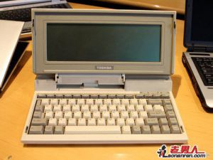

# 80286

IBM于1986年生产的基于80286的计算机。

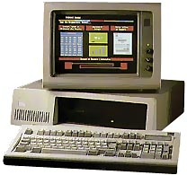

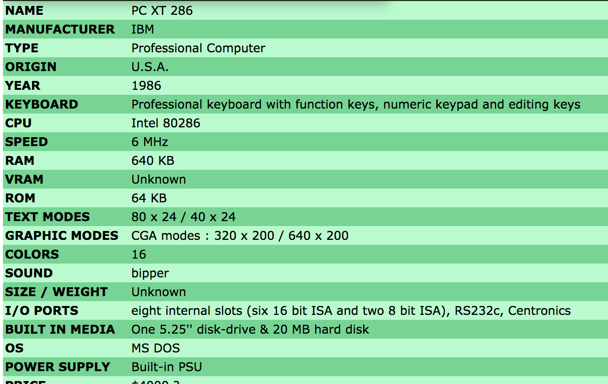

下图是PC XT 286的升级版，PC AT,它使用80286 CPU, 运行MS DOS 3.0， 有256KB（第一代）或512KB\(第二代）内存，支持5.25英寸软盘，支持20MB的硬盘:

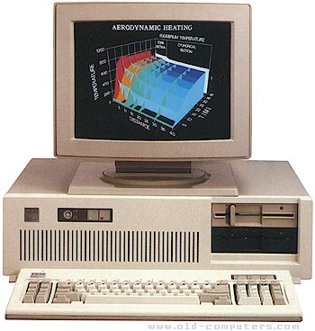

下图是80286的框图，从图中可以看出，相对于8086的计算机，内存不是直接接在CPU上，而是挂到L2 Cache之后，L2 Cache又挂在DRAM与L2 Cache控制器下面，L2 Cache控制器才直接与CPU的系统总线相连。  
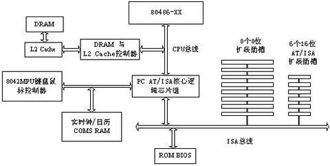

# 奔腾4

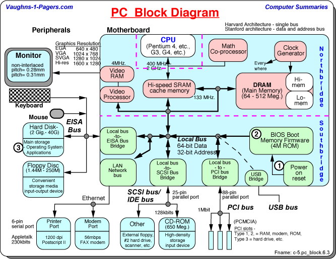

# Celeron M

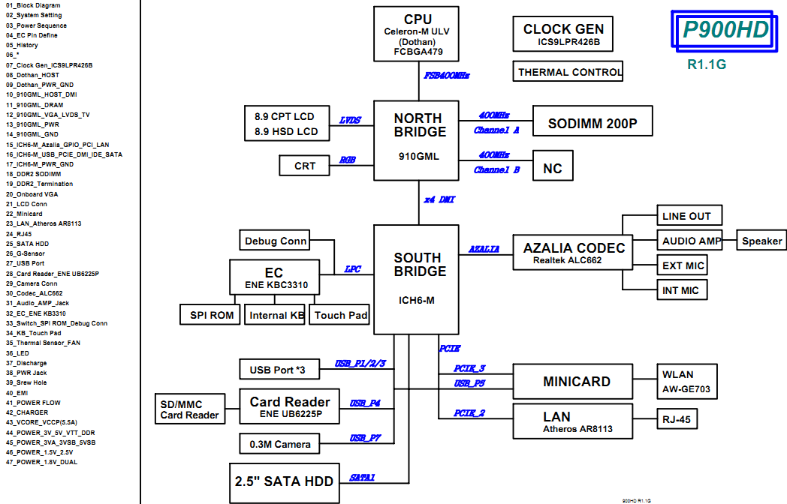

# Intel Core

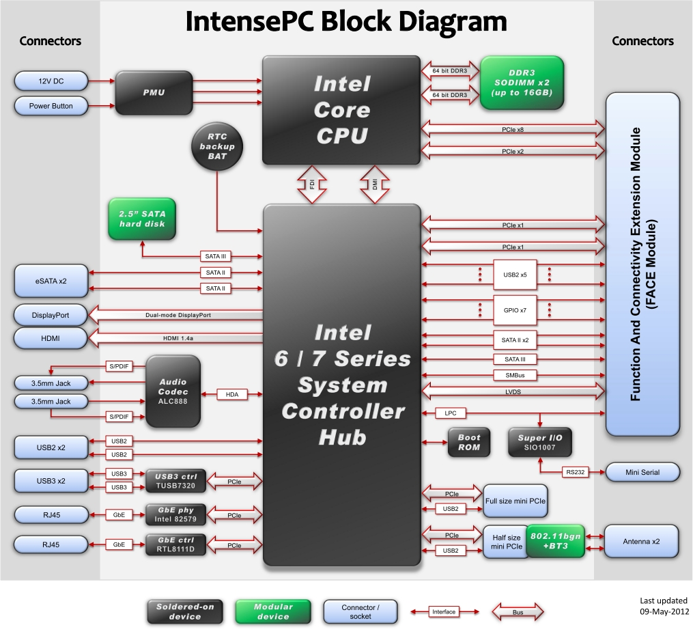

# Intel Core gen 5

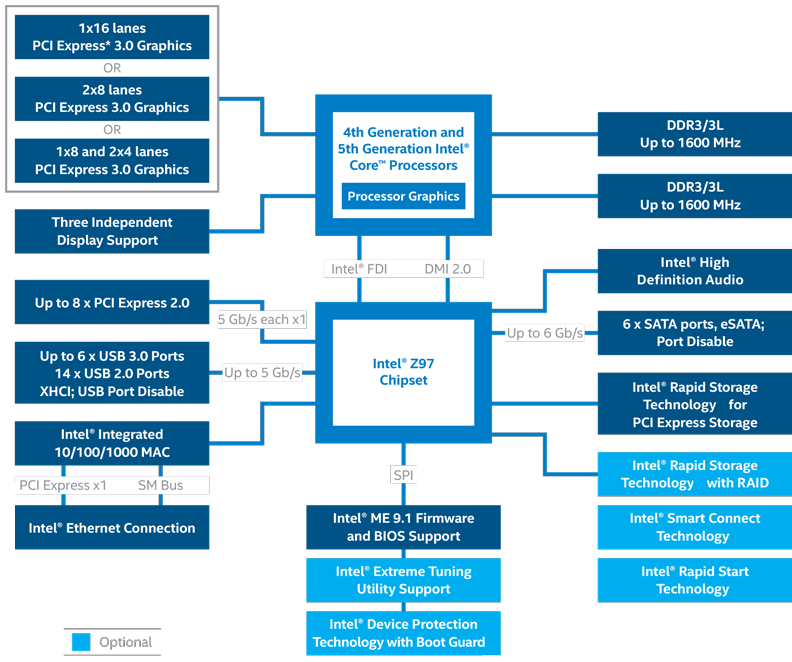

# Atom

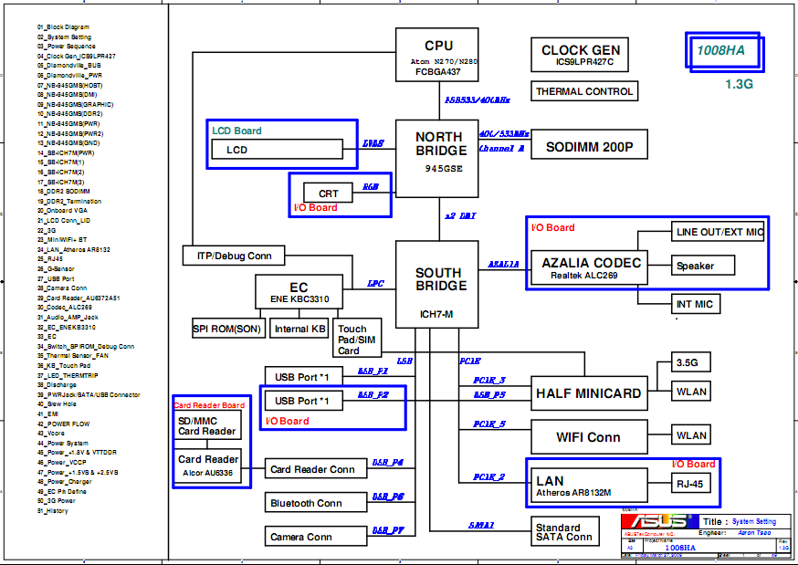

